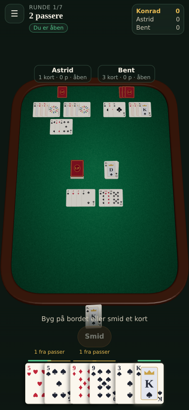
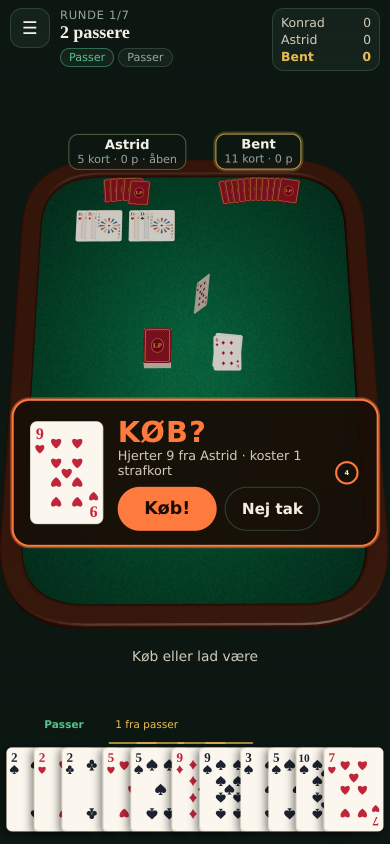
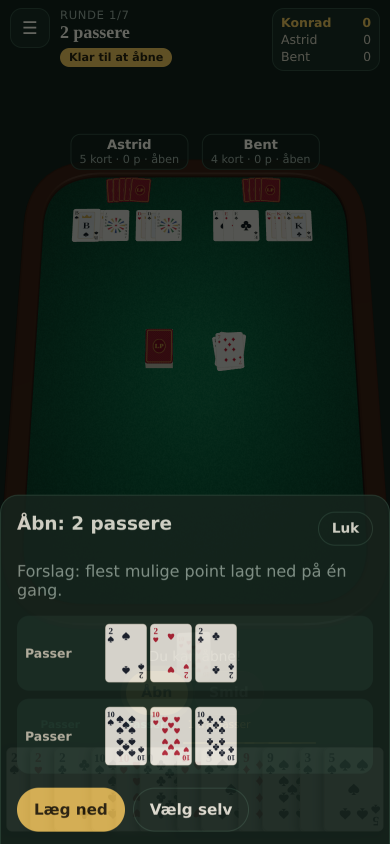
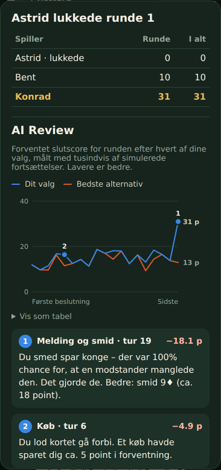

# Løbere og Passere

A web simulator of the Danish contract rummy game _Løbere og Passere_, played against a computer that makes the
statistically best choice in every decision, or online with friends and strangers. It is built from the PRD in these
packages:

| Package           | What it is                                                                                                                           |
| ----------------- | ------------------------------------------------------------------------------------------------------------------------------------ |
| `packages/engine` | `@kova/rummy-engine`: pure, deterministic TypeScript rules engine. Zero runtime dependencies. 3-5 players.                           |
| `packages/ai`     | `@kova/rummy-ai`: card counting, opponent inference, evaluation function, ISMCTS, self-play harness, post-round review.              |
| `packages/net`    | `@kova/rummy-net`: online play. Wire protocol, per-seat views and the client-side table reconstruction.                              |
| `apps/web`        | `@kova/web`: Next.js app (static export). react-three-fiber table, HTML hand overlay, AI in a Comlink Web Worker, IndexedDB storage. |
| `apps/server`     | `@kova/rummy-server`: authoritative WebSocket game server for online tables, with computer players in worker threads.                |

Solo play runs entirely in the browser. Online play needs the small game server in `apps/server` (see
[Online play](#online-play)).

<p>
  
  
  
  
</p>

## Quick start

```bash
corepack enable            # or: npm i -g pnpm@10
pnpm install
pnpm dev                   # http://localhost:3000
pnpm dev:server            # game server for online play on ws://localhost:8787/ws
pnpm test                  # engine, AI, net, server and web tests
pnpm typecheck
pnpm build                 # static site in apps/web/out
```

Other scripts:

```bash
pnpm fuzz                  # 10,000 random 7-round games, invariants checked after every action
pnpm fuzz -- 500           # smaller campaign
pnpm selfplay -- --games 200 --agents hard,medium,medium --time 1200
pnpm selfplay -- --games 1000 --agents medium,easy,easy
```

## Deploying to Vercel

The app is a fully static export, so either of these works:

1. **Import the repo and keep the root directory** (recommended). `vercel.json` at the root tells Vercel to install with
   pnpm, run `pnpm --filter @kova/web build` and publish `apps/web/out`.
2. **Set the Root Directory to `apps/web`.** Vercel then detects Next.js by itself. The workspace packages are resolved
   from the monorepo root, and Next.js handles `output: 'export'`.

No environment variables are needed for solo play. Node 22 or newer is required (`.nvmrc`).

Optional environment variables (read at build time, so redeploy after changing them):

| Variable                      | Purpose                                                                                                    |
| ----------------------------- | ---------------------------------------------------------------------------------------------------------- |
| `NEXT_PUBLIC_MULTIPLAYER_URL` | The game server, e.g. `wss://rummy-server.up.railway.app`. Turns on online play (see below).               |
| `GOOGLE_SITE_VERIFICATION`    | Content of Google Search Console's "HTML tag" verification. Adds `<meta name="google-site-verification">`. |
| `NEXT_PUBLIC_SITE_URL`        | Canonical origin for a custom domain, e.g. `https://example.dk`. Defaults to Vercel's production domain.   |

## Online play

`/online/` lists the public tables. Players can press **Hurtigt spil** to sit down at an open table (or start one),
create a table for everyone or a private one (joined with a five-letter code or an invite link), and the host starts the
game when ready. Seats nobody takes get a computer player at the chosen level. No accounts: a random token in the
browser keeps the seat, so a reload or a dropped connection returns to the same table.

How it works:

- **The server is authoritative.** It holds the only full `GameState`, validates every move with the engine and sends
  each seat its own `PlayerView`. Hidden cards never leave the server, and neither does the shuffle seed; every round is
  dealt from a fresh server-side seed, so revealing a finished round for the review gives nothing away.
- **The browser rebuilds the table** from that view and the round's public event log (`reconstruct` in
  `packages/net`), with face-down stand-ins for cards it cannot see. The same game screen as solo play renders it, and
  the 3D table animates a revealed card from where its stand-in lay.
- **Nobody waits forever.** Each turn has a clock (30-120 s, chosen by the host). When it runs out, or a player has
  dropped, the computer plays that turn; an unanswered "KØB?" is a pass. A player who leaves is replaced by a computer.
  The next round starts when everyone has pressed **Næste runde**, or after 45 s.
- **Computer players** use the same AI as solo play, in worker threads so the hard level never blocks the server.

### Deploying the game server

Vercel serves the static site but cannot keep WebSocket connections open, so the server runs on a host that can. It is
a plain Node process in a Docker image (`apps/server/Dockerfile`, built from the repository root), so any container host
works. Two ready-made setups:

- **Railway** (the PRD's choice): create a project from this GitHub repo. `railway.json` builds the Dockerfile and uses
  `/health` as the health check. Under Settings > Networking, generate a public domain.
- **Render**: create a Blueprint from this repo. `render.yaml` sets up a free web service. Free services sleep after a
  while without traffic and take about a minute to wake up.

Then:

1. On the server host, set `ALLOWED_ORIGINS` to the site's origin, e.g. `https://rummy-dusky.vercel.app` (comma-separated
   for several; unset allows any origin).
2. In Vercel, set `NEXT_PUBLIC_MULTIPLAYER_URL` to the server's address, e.g. `wss://rummy-server.up.railway.app`
   (`https://` also works, and `/ws` is added), and redeploy. The front page then shows **Spil online**.

Server settings: `PORT` (set by the host), `ALLOWED_ORIGINS`, `BOT_THREADS` (default: CPU cores - 1) and `BOT_PACE`
(1 = human-like pauses for computer players). `GET /health` and `GET /lobby` return JSON.

Locally, `pnpm dev:server` starts the server on port 8787, and the site on `localhost` finds it without configuration.

## Card designs and zoom

Three card designs, chosen when starting a game or from the menu during play, apply to the hand, the 2D table and the 3D
table alike:

- **Standard**: painted in the browser, with big Danish indices (E, B, D, K).
- **Klassisk**: traditional court cards. Designed by rawpixel.com / Freepik.
- **Moderne**: flat, colourful illustrations. Designed by macrovector / Freepik. Joker and back drawn to match.

The Freepik licence requires that attribution on the site; the front page footer and the design picker carry it. The
atlases in `apps/web/public/cards` are rendered from the vector originals by `scripts/cards/build-atlases.mjs`; the
original EPS files are not in the repository.

The 3D table zooms with a pinch, the mouse wheel, a double tap or the **+**/**−** buttons, and pans by dragging while
zoomed in.

## SEO and Google Search Console

The site ships what Search Console looks for: `/robots.txt`, `/sitemap.xml` (the front page, online play and the rules), a canonical
URL, title, description and Open Graph/Twitter card on every page, JSON-LD (`WebSite` and `VideoGame` on the front page,
`BreadcrumbList` on the rules), a web manifest and icons. The game table (`/spil/`) and the local statistics page
(`/statistik/`) are `noindex`, because they have no content for a crawler. Everything lives in `apps/web/app` plus
`apps/web/src/lib/site.ts`.

To register the site:

1. In [Search Console](https://search.google.com/search-console), add a **URL prefix** property for the production URL,
   e.g. `https://rummy-dusky.vercel.app/`. (A **Domain** property needs a DNS record, so it only works on a custom
   domain.)
2. Choose the **HTML tag** method and copy the `content` value only.
3. In Vercel, add it as `GOOGLE_SITE_VERIFICATION` under Settings > Environment Variables (Production), and redeploy.
4. Click **Verify** in Search Console.
5. Under **Sitemaps**, submit `sitemap.xml`.

Alternatively, use the **HTML file** method: put the downloaded `google….html` file in `apps/web/public/` and deploy.

## The rules as implemented

The engine follows PRD section 2 exactly. The four open rule questions are switches in `RuleOptions`
(`packages/engine/src/rules.ts`). Players pick them under "Husregler" when starting a game:

| Question                                          | Option                 | Default   |
| ------------------------------------------------- | ---------------------- | --------- |
| Build on the table in the same turn you open?     | `buildOnOpeningTurn`   | no        |
| Swap a joker on the table for the real card?      | `jokerSwap`            | yes       |
| Closed pile runs out: reshuffle the discard pile? | `reshuffleDiscards`    | yes       |
| Limit on buys per player per round?               | `maxBuysPerRound`      | unlimited |
| **New melds after opening** (found in simulation) | `newMeldsAfterOpening` | yes       |

The last row was not in the PRD. A passer can hold at most one card per suit, so four cards. Self-play showed that if
opened players may only build on existing melds, rounds deadlock once the passere on the table are full. A player then
draws one card and discards one forever. Only 8% of simulated round-1 games ended. With the switch on (the default),
an opened player may lay new passere/løbere in later turns, and nearly every round finishes. The family can still turn
it off.

Other interpretations the engine makes explicit:

- Every meld needs at least one natural card. Jokers in a passer stand in for missing suits (max 4 cards).
- An ace is low (E-2-3-4) or high (B-D-K-E) but never both, so a løber has at most 13 cards.
- Buy window: the next player's free "first right" is the draw phase itself. Drawing from the closed pile declines the
  card, which opens the `buy` phase for everyone else except the player who discarded it. The first claim wins. The
  buyer takes the card plus one penalty card, and then the declining player draws. The upcard dealt at round start can
  also be bought.
- A player goes out by laying or discarding the last card. A round that reaches 400 turns ends and everyone counts their
  hand. This is a safety valve for the fuzzer, never reached in real play.

## Engine

`applyAction(state, action) => newState` never mutates its input. The state machine per turn is
`draw -> (buy) -> meld -> discard`. `legalActions`, `validateAction`, `isRoundOver`, `scoreHand`, `getPlayerView` and
`checkInvariants` make up the rest of the API. Seeded mulberry32 RNG lives inside the state, so the same seed and the
same action log always give the same game. Replays, resume and the AI review rely on this.

Tests (`packages/engine/test`):

- Unit tests for every rule and edge case: ace high/low, wrap-around, joker substitution and swaps, opening with extra
  cards and melds, buy race, buy limit, reshuffle, scoring, round and game end.
- The contract validator is cross-checked against a brute-force oracle on thousands of random hands.
- Property-based tests (fast-check): card conservation (always 108), never an opening without a valid contract,
  deterministic replay from seed, invariants through random games with random house rules.
- Fuzz: 10,000 random 7-round games with 3-5 players (70,000 rounds, 21.9M actions) with zero invariant violations.

## AI

No language model, only probability. The layers are in `packages/ai/src`:

1. **Card counting** (`knowledge.ts`): the exact multiset of unseen cards. That is 108 cards minus your own hand, the
   discard pile, the table, and the cards an opponent is known to hold because they picked them up.
2. **Opponent inference** (`knowledge.ts`): every observable action re-weights, per opponent, how likely each card
   type is to be in their hand. The signals are taking or buying a card, declining one, discarding one, and opened
   players never keeping table-playable cards. `determinize.ts` samples full worlds from these weights and never breaks
   the hard constraints.
3. **Evaluation and decisions** (`plan.ts`, `policy.ts`): a backtracking contract planner prices every missing card by
   its outs, giving expected draws to the contract. On top of that sit hand points weighted by round-end risk and the
   cost of feeding an opponent. This drives draw, buy, open-now-vs-wait and discard.
4. **ISMCTS** (`ismcts.ts`): for each decision the candidate plans are evaluated on the same sampled worlds (common
   random numbers), and each world is played to the end of the round with the evaluation policy for every seat. The
   search picks the lowest expected penalty points, stays with the greedy choice unless the evidence is clear, and
   runs within a time budget (about 1-1.3 s per turn in the Web Worker).

Difficulties: `easy` = random with basic sense, `medium` = greedy evaluation, `hard` ("Umulig") = ISMCTS.

### Self-play validation

Seats rotate every game. The numbers below were measured with `pnpm selfplay` in this repository:

| Match (games)                                   | Agent  | Avg total | Avg place | Win rate |
| ----------------------------------------------- | ------ | --------: | --------: | -------: |
| greedy vs 2 random (1,000)                      | medium |       5.4 |      1.00 |     100% |
|                                                 | easy   |     634.1 |      2.50 |       0% |
| ISMCTS vs 2 greedy (240, 100 worlds / decision) | hard   |     189.3 |      1.95 |    37.9% |
|                                                 | medium |     197.8 |      2.02 |    31.5% |

In a 3-player game 33.3% is an even share. ISMCTS beats greedy on points, placement and win rate, but only modestly:
about 1.5 standard errors on 240 games. The PRD's acceptance target ("markant", 10,000+ games) is **not met yet**. A
hard game costs about 35 s of CPU in the harness, so 10,000 games need about 100 CPU-hours. The harness supports it
(`pnpm selfplay -- --games 10000 --agents hard,medium,medium`).

What the experiments showed along the way:

- The ISMCTS is limited by noise. With 12-20 sampled worlds per decision it played worse than greedy. Anchoring on the
  greedy choice and switching only on clear evidence fixed that.
- Rollout opponents must be as strong as the real ones. With a weaker rollout policy the search assumed rounds would
  last longer, played too slowly and closed fewer rounds.
- Next steps: test whether more worlds per decision help (under 20 lost to greedy, 100 wins modestly), add a leaf
  evaluation to cut rollout variance, and widen the candidate sets for the buy and open-now decisions.

## AI Review

After every round the review worker replays the round from its start state and the action log. At each of your
decisions it estimates the expected final round points of what you did and of the best alternative, using 40 sampled
worlds per decision, more than live play gets. The round summary shows the curve, the two most expensive decisions
with an explanation (for example "Du smed spar 8 – der var 34% chance for, at en modstander manglede den. Det gjorde
de."), and the total expected loss. The stats page (`/statistik/`) tracks win rate, points per round, streaks, best
game and review loss over time.

## Web app

- **3D table** (`src/components/three`): one texture atlas holds all 54 card motifs plus the back (painted on a canvas,
  or the chosen design's image), with one material and one small geometry per motif. Cards ease towards poses from the mapping layer
  (`src/lib/tableModel.ts`): they arc, flip, snap into melds, and the camera pans a little towards the active player.
  The table is portrait-shaped on phones and landscape-shaped on wide screens.
- **2D fallback** (`Table2D.tsx`) renders the same table model. It is used when WebGL is missing or chosen in the menu.
- **HTML overlay**: auto-grouped hand (complete melds, "1 fra passer/løber", loose cards), drag to reorder, contract
  progress chips, scores, the pulsing "KØB?" prompt with a countdown, an opening sheet with the validator's suggestion
  or manual grouping, and confetti when someone lays the whole hand at once.
- **Persistence**: each game is stored in IndexedDB as seed plus action log, and resumed by replaying it.

## Not built yet

Accounts, friends lists, chat and online statistics. Online tables are anonymous (a name and a browser token), and
online games are not saved to the statistics page, which stays local to the device.
